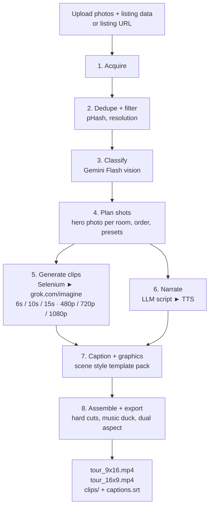

# Real Estate Video Project — Project Description

**Status:** built — see [README.md](README.md)
**Last updated:** 2026-09-20 · implemented, see §0
**Working dir:** `/Users/jeroenerne/Dropbox/Claude/Projects/RealEstateVideoProject`

---

## 0. Build notes — what changed when this was implemented

This document is the original design. The app in this repository implements it, with four
deliberate departures. Where the two disagree, **the code is right and this section says why**.

| Spec said | Built instead | Why |
|---|---|---|
| Drive `grok.com/imagine` through Selenium (§4 Stage 5) | The **Replicate API** (`lib/replicate.ts`) | Replicate carries the same model as a first-party API (`xai/grok-imagine-video`) alongside Wan and Kling. That removes the ToS problem, the bot detection and the breaks-whenever-the-UI-changes problem in one move — and §8.4's "brittleness budget" for the Grok driver disappears with it. |
| One vision call returns structured room JSON (§4 Stage 3) | **Two passes**: a vision model *describes*, then **Jev** *judges* (`lib/jev.ts`) | Jev is text-only, so the split is forced. But it is also better: Jev returns a probability for every option and a confidence for the answer, which is what §7.5's human-in-the-loop needs to know when to ask. A vision model's free-form JSON gives a label with no honest measure of its own certainty. |
| Python CLI first, website in phase 2 (§2.10, §12) | **Next.js app directly** | The free tier renders in a browser, which means the browser had to be the runtime anyway. A CLI would have been a second implementation of the same pipeline. |
| ffmpeg assembly on a server (§4 Stage 8); HTML overlays via headless Chrome (§7.4) | **Canvas + MediaRecorder in the browser** (`lib/render/`) | No render farm, no upload of the user's photos, and the finished video never touches our disk. The cost is that rendering is real-time. See the README on the stall watchdog this makes necessary. |

Two further corrections the build turned up:

- **§2.2 was right that "Gemini Flash 3.7" is not real** — and `google/gemini-3-flash` is not
  either. The app uses `google/gemini-2.5-flash`.
- **§9's `isPhotograph` hard drop was wrong.** Excluding anything that is not a photograph of a
  real place silently threw away every new-build listing advertised with architectural renders.
  It now only costs a photo the hero slot. Room type is the single hard filter.

The pricing model in §10 stands, with one change: **there is no subscription at all**, only
credit packs at a flat 10x the measured API cost (`lib/pricing.ts`).

---

## 1. What this is

A product that turns a **property listing** — uploaded photos and listing data, or a link to an
Airbnb / Booking.com / MLS listing the user controls — into a **finished, narrated property
tour video**, sold per video or by subscription.

The core idea: every listing already has one good photo per room. If we can (a) get those
photos, (b) work out which room each photo is, and (c) animate each photo with a camera move
appropriate to that room type, then narrate and caption the result, we get a broadcast-looking
tour for any listing in minutes — no site visit, no videographer, no drone.

```
photos / listing URL ──► room labels ──► shot list ──► clips ──► voiceover ──► captions ──► tour video
      scraper/upload    Gemini Flash     planner    Grok Imagine    LLM+TTS    templates     ffmpeg
```

### The moving parts

| Part | Tool | Why |
|---|---|---|
| **Acquire** | Direct upload, or a Selenium scraper for Airbnb / Booking.com / MLS | Those sites lazy-load galleries behind JS; a plain `requests` fetch gets nothing useful. Upload is the primary path (§3); the scraper is a convenience for the user's own listings. |
| **Understand** | Gemini Flash (vision) | Cheap, fast, structured output. One call per photo → room type + quality score + a short visual description. |
| **Generate** | grok.com/imagine, driven by Selenium | No public API for image-to-video at the quality/price we want, so we drive the web UI in a logged-in browser profile. |
| **Narrate** | LLM script + TTS | A tour without narration is a slideshow. The script is written from listing data, never invented. |
| **Finish** | Headless-Chrome overlays + ffmpeg | Motion-graphic scene templates, captions, music ducking, dual-aspect export. |

---

## 2. Assumptions & open decisions

1. **"Download the videos" from Airbnb/Booking → I read this as downloading listing *media*,
   which is overwhelmingly photos.** Those sites almost never host per-room video. The
   scraper is photo-first with an opportunistic video path if a listing does have a tour.
2. **"Gemini Flash 3.7"** — there is no 3.7 in the Gemini Flash line (2.0 / 2.5 / 3 Flash are
   real; 3.7 is a Claude version number). It's a config value (`vision.model`), so this is
   free to correct.
3. **One clip per room, not per photo.** 40 photos might be 8 distinct rooms. We pick the best
   photo per room and generate one clip from it.
4. **Clip duration: 6s default, 10s and 15s optional** (`shots.duration_s`). A 10-shot tour is
   therefore 60s / 100s / 150s. 60s is the sweet spot for Reels/Shorts/TikTok; 10s and 15s
   tiers exist for luxury listings and for narration-driven timing (§7.3).
5. **Resolution: 720p standard, 480p and 1080p optional** (`export.resolution`). See §4.5 on
   what Grok returns natively — some tiers are an upscale, and the config is honest about it.
6. **Both aspect ratios ship by default: 9:16 and 16:9.** 9:16 is the primary (social); 16:9 is
   the portal/YouTube/MLS cut.
7. **Voiceover is on by default, captions are optional** (`captions.enabled`, default true for
   9:16, false for 16:9 — burned-in captions look wrong on a portal embed).
8. **Still no transitions between clips — hard cuts only.** Note the distinction: the *overlay*
   motion graphics animate (that's §7.4), the *cuts* don't. Transitions are phase 3.
9. **Rights model: the user's own listings only, with an explicit attestation.** See §3.
10. **Local-first build.** Phase 1 is a Python CLI on the filesystem; the website (§11) wraps
    the identical stages behind a job queue.

---

## 3. Rights, permission & the legal model

**The product is for people making videos of listings they control** — the owner, the host, or
the listing agent/broker. That constraint is what makes the whole thing defensible, and it
needs to be enforced in the product, not just in the terms.

### 3.1 The attestation

Every job is gated on an explicit rights attestation captured at submission:

> ☑ I own this property or am the authorised agent for this listing, and I have the right to
> use these photos and listing details to create and publish a promotional video.

**Implementation:**

- Stored on the job as a first-class record, not a UI detail:
  ```json
  "attestation": {
    "accepted": true,
    "text_version": "rights_v1",
    "text_sha256": "…",
    "accepted_at": "2026-09-01T14:22:07Z",
    "user_id": "usr_…",
    "ip": "…",
    "user_agent": "…",
    "method": "checkbox_prechecked"
  }
  ```
- The exact wording lives in `legal/attestation_rights_v1.txt`, versioned and hashed, so you can
  always prove *what* the user agreed to on a given date. Never edit a version in place — add
  `_v2`.
- Blocking: no attestation, no job. The API rejects job creation with `422 attestation_required`.

**On pre-checking it by default:** you asked for the box to be checked by default, and
`legal.rights_checkbox_default_checked` does exactly that. One flag worth knowing before you
ship it that way — a pre-ticked box is materially weaker evidence if a copyright claim ever
lands ("I never actively agreed"), and pre-ticked boxes are invalid for consent under EU rules,
which makes a pre-ticked *warranty* look bad by association even though it's a different legal
instrument. My recommendation is `false` for this specific box and pre-checked for everything
else (marketing emails, ToS acknowledgement). Your call — the flag is there either way, and
either way the attestation is logged with timestamp and IP, which is the part that actually
matters.

### 3.2 What this buys you, and what it doesn't

- **Buys:** a clear representation from the user that shifts responsibility for the source
  material to them, plus an audit trail. This is the standard shape for every UGC/print-on-
  demand/AI-media product.
- **Doesn't buy:** immunity. You still need a **takedown route** (§3.3) and you should still
  not build features that encourage scraping someone else's listing.

### 3.3 Operational consequences

- **Takedown flow.** A documented contact address, a 1-click internal action that soft-deletes
  a job (photos, clips, renders, public links) and records who requested it and when.
- **URL ingestion is a convenience, not a licence.** Scraping Airbnb/Booking is still against
  their ToS regardless of who owns the listing. Keep it available for the user's own listings,
  keep the **upload path as the default and the marketed path**, and don't build a "paste any
  URL you find" feature.
- **MLS is a separate licensing world.** MLS photos are typically licensed to the listing
  broker, and IDX/VOW rules restrict redistribution. Only the listing agent/broker can
  authorise a video. The MLS ingest path should ask for the agent's MLS ID and record it in
  the attestation.
- **Retention.** Source photos deleted after `legal.source_retention_days` (default 30);
  renders kept while the subscription is active. Shorter retention is less exposure.
- **AI disclosure.** `export.ai_disclosure_tag` (default on) burns a small
  "AI-generated visualisation" tag. Some portals and MLS rules require it, and it's the honest
  thing to do given the footage is synthesised from stills.
- **Fair-housing language.** For US listings the narration must not reference race, religion,
  national origin, family status, or disability. This is a hard constraint in the script prompt
  and a post-generation checklist (§7.2).
- **Automating grok.com via Selenium is against xAI's ToS** and will break when the UI changes.
  Isolate the selectors (§8.4) and move to an official API the moment one exists.

---

## 4. Pipeline in detail



Every stage is **idempotent and resumable**. Each reads the job manifest, skips work whose
output exists and whose input hash is unchanged, and writes results back. Stages 5 and 6 run in
parallel — narration doesn't depend on the clips existing, only on the shot list.

---

### Stage 1 — Acquire

**Two entry paths, same output shape:** `photos/raw/NNN.jpg` + `listing.json`.

**Path A — upload (primary).** The user uploads photos and fills in listing data: title,
address, price, beds, baths, floor area, key features, description, agent/host details. This
is the path with no ToS exposure and the one the product markets.

**Path B — listing URL (convenience, own listings only).** One Selenium adapter per site,
all implementing:

```python
class ListingAdapter(Protocol):
    domain: str
    def matches(self, url: str) -> bool: ...
    def extract(self, driver, url: str) -> Listing: ...
```

`Listing`: `listing_id`, `source`, `url`, `title`, `address_text`, `price_text`, `bedrooms`,
`bathrooms`, `floor_area`, `capacity`, `amenities[]`, `description`, `agent{}`, `photos[]`
(each `url`, `caption`, `gallery_index`, `alt_text`).

- **Airbnb** — dismiss the modal, click "Show all photos" to reach the `/photos` route, scroll
  the modal container until the count stops growing. Photos come from `a0.muscache.com`;
  rewrite `?im_w=1200` → `im_w=2560` for the high-res variant. **Airbnb's gallery captions are
  gold** — often literally "Bedroom 1", "Kitchen", "Pool" — and act as free priors for Stage 3.
- **Booking.com** — the page embeds a JSON blob with the full photo list; parse that first, fall
  back to DOM scraping. Rewrite `/max500/` → `/max1920/`.
- **MLS / portal formats** — varies by market. Where a structured feed exists (RESO Web API,
  IDX feed), use it: it gives clean room-by-room data and photo captions, which makes Stage 3
  nearly free. Where it doesn't, a per-portal adapter like the two above.
- **Agoda** — heavily lazy-loaded and aggressive about bot detection; small randomised scroll
  increments, wait for each `img` to leave placeholder state. Its gallery categories are
  another free prior.

**Shared mechanics:** `undetected-chromedriver`, a persistent user-data dir per site,
randomised viewport and scroll cadence, `WebDriverWait` on real conditions rather than
`sleep()`. Images are downloaded with `httpx` using the driver's cookies (faster, and gives us
content hashes). On failure, dump `debug/<stage>/<ts>.png` + `.html`.

### Stage 2 — Dedupe & filter

Listings repeat photos and include floor plans, maps, and logos. Before spending vision calls:

- **Perceptual hash** (`imagehash.phash`), Hamming ≤ 6 → duplicate, keep the higher resolution.
- Drop images under `scrape.min_width` (800px) or with extreme aspect ratios.
- Drop obvious non-photos on a cheap heuristic (flat regions / low colour variance → floor plan
  or map). The classifier labels the rest for exclusion.

### Stage 3 — Understand (Gemini Flash vision)

One call per surviving photo, concurrency 8, structured JSON output:

```json
{
  "room_type": "kitchen",
  "room_confidence": 0.94,
  "secondary_types": ["dining_room"],
  "is_interior": true,
  "space_group_hint": "kitchen with white shaker cabinets and black island",
  "visible_features": ["island", "pendant lights", "gas range", "window over sink"],
  "camera_depth": "wide",
  "primary_axis": "left_to_right",
  "lighting": "bright daylight",
  "quality": { "sharpness": 0.9, "exposure": 0.8, "clutter": 0.15, "people_present": false },
  "video_suitability": 0.88,
  "one_line_description": "modern white kitchen with a black stone island and three pendants"
}
```

**Taxonomy:** `exterior_front`, `exterior_rear`, `entry`, `hallway`, `living_room`, `open_plan`,
`dining_room`, `kitchen`, `bedroom`, `kids_room`, `bathroom`, `ensuite`, `home_office`,
`laundry`, `garage`, `balcony`, `terrace`, `garden`, `pool`, `gym`, `view`, `detail`,
`floorplan`, `map`, `other`.

Four fields do real work downstream:

- **`video_suitability`** — ranks photos to pick the hero shot per room. Folds in sharpness,
  exposure, how much of the room is visible, and whether people are present (people warp badly
  when a still is animated).
- **`camera_depth` / `primary_axis`** — picks *which* camera move suits this photo (§6.3).
- **`space_group_hint`** — fingerprint for merging photos of the *same physical room*, so three
  bedrooms become three groups rather than one.
- **`one_line_description`** — feeds the narration script (§7.2) so the voiceover describes what
  is actually on screen.

**Grouping same-room photos:** cluster within each `room_type` by caption similarity (when the
source gave captions), `space_group_hint` similarity, and colour-histogram distance. Ambiguous
pairs get one extra Gemini call ("same physical room? yes/no"). Groups are numbered
(`bedroom_1`, `bedroom_2`) and cross-checked against the stated bedroom count.

**Priors:** captions and gallery categories are passed as hints and break low-confidence ties.
Anything below `vision.min_confidence` (0.55) with no prior lands in `needs_review` rather than
being silently mislabelled.

### Stage 4 — Plan the shot list

Pure logic, no model calls.

1. **Select rooms** — drop excluded types, cap at `shots.max_clips` (default 10) by
   `video_suitability × room_priority`.
2. **Pick the hero photo** per room group — highest `video_suitability`.
3. **Assign a preset** — room type → prompt preset (§6), refined by `camera_depth` /
   `primary_axis` (§6.3).
4. **Order the clips** in the fixed narrative order estate agents actually use:
   `exterior_front → entry → living_room → open_plan → dining_room → kitchen →
   bedroom_1..n → bathroom_1..n → home_office → balcony/terrace → garden/pool → view →
   exterior_rear`. Missing types are skipped, not padded.
5. **Resolve duration per shot** — fixed from config, or narration-driven (§7.3).
6. **Emit `shotlist.json`** — per clip: resolved prompt, source photo, duration, resolution,
   aspect, and a deterministic `shot_id` = `sha1(photo_hash + prompt + duration + resolution +
   aspect)`. That hash is the cache key: change the prompt, get a new clip; re-run unchanged,
   get a cache hit.

### Stage 5 — Generate clips (Selenium → grok.com/imagine)

**One shot per room, per the §6 prompts.** Input: one shot record. Output:
`clips/<shot_id>.mp4`.

Per shot, in a long-lived logged-in browser session:

1. Navigate to the Imagine surface; assert logged in (cookie + DOM check), else raise
   `AuthRequired` — the operator logs into the persistent profile once, manually.
2. Switch to **image-to-video** mode.
3. Upload the hero photo via `send_keys` on the file input (never an OS file dialog).
4. Enter the resolved prompt. Set duration and aspect where the UI exposes them.
5. **Poll for completion** — primary signal is the `<video>` element / download control
   appearing; secondary is the performance log for the asset URL. Timeout `grok.timeout_s` (300).
6. Download with `httpx` + session cookies. Verify with `ffprobe` (has a video stream, duration
   within tolerance of the requested tier, non-zero bitrate) before marking success.
7. Record to `clips.json`: `shot_id`, prompt, path, measured duration, native resolution,
   attempt count, timestamp, thumbnail.

#### 4.5 Duration and resolution tiers

| Setting | Default | Options | Notes |
|---|---|---|---|
| `shots.duration_s` | **6** | 10, 15 | Per shot. 10 shots → 60s / 100s / 150s. Longer tiers cost proportionally more generation time and give the narration more room. |
| `export.resolution` | **720p** | 480p, 1080p | See below. |
| `export.aspects` | `["9:16", "16:9"]` | either alone | Both by default. |

**Be honest about resolution.** Grok returns clips at its own native size. The pipeline
normalises every clip to the requested tier, which means:

- **480p** — always a genuine downscale. Cheapest, right for previews and drafts.
- **720p** — the standard tier; downscale or near-native depending on what Grok returns.
- **1080p** — a **conditional upscale**. If the native output is below 1080p we upscale with
  `lanczos` (and optionally a light `unsharp`), and the job records `upscaled: true` so the UI
  can label it rather than implying native 1080. Never advertise 1080p as "native".

`export.native_portrait` (default `false`) controls whether 9:16 is *generated* natively rather
than centre-cropped from the native aspect. Native portrait doubles generation cost and time —
worth it for the social cut on premium plans, off by default.

**Robustness — this is the fragile stage:**

- **Serial, not parallel.** One tab, one generation at a time, randomised `inter_request_delay`
  (8–20s). Parallel tabs get flagged.
- **Retries** with exponential backoff, max 3, on timeout / empty result / content-filter
  rejection. A filter rejection retries with a softened prompt variant.
- **Circuit breaker** — 3 consecutive failures pauses the run and writes a resume token, so a
  rate-limit doesn't burn the queue.
- **All selectors in `generate/selectors.py`** with a `verify_selectors()` smoke test.
- **Failure artefacts** — screenshot + DOM dump per failed attempt.

### Stage 6 — Narrate

Runs in parallel with Stage 5. Produces `script.json` and `vo/<shot_id>.mp3`. Full detail in §7.

### Stage 7 — Caption & graphics

Produces `captions.ass` / `captions.srt` and the overlay assets from the selected scene style
template pack. Full detail in §7.4–7.5.

### Stage 8 — Assemble & export

- **Normalise** every clip: target resolution, fps 30, pixel format, SAR — otherwise `concat`
  chokes on mismatched streams.
- **Concat in shotlist order, hard cuts.** No transitions (§2.8).
- **Overlay** the scene-style motion graphics (§7.4) and, if enabled, burn in captions.
- **Mix audio**: voiceover at −3 dBFS peak, music bed ducked to roughly −18 dB under the VO via
  `sidechaincompress`, 1s fades at both ends.
- **Export both aspects.** The 9:16 is a safe-area-aware centre crop of the native aspect
  unless `native_portrait` is on; overlays are laid out per aspect, not cropped (§7.5).
- **Optional extras**: agent logo watermark, "AI-generated visualisation" tag (default on),
  listing title/price lower-third on the first clip.
- **Also ship the parts**: individual clips, the VO track, and a sidecar `.srt`. Agents re-cut
  these for other channels, and giving them the parts is a retention feature.

---

## 5. Data model & layout

```
RealEstateVideoProject/
├── PROJECT.md
├── config.yaml
├── legal/
│   └── attestation_rights_v1.txt      # versioned, hashed, never edited in place
├── templates/                          # scene style packs (§7.4)
│   ├── clean_minimal/{template.json,overlay.html,style.css,fonts/}
│   ├── luxury_serif/
│   └── bold_social/
├── src/
│   ├── cli.py                  # scrape | classify | plan | generate | narrate | caption | assemble | run
│   ├── models.py               # pydantic: Listing, Photo, Analysis, Shot, Clip, Script, Beat
│   ├── manifest.py             # job.json load/save/merge, hashing, resumability
│   ├── scrape/{base,airbnb,booking,agoda,mls}.py
│   ├── vision/{classify,dedupe,grouping}.py
│   ├── plan/{prompts,planner}.py        # prompts.py is the important one (§6)
│   ├── generate/{grok_driver,selectors}.py
│   ├── narrate/{script,tts,timing}.py   # §7
│   ├── caption/{subtitles,overlays,render}.py
│   └── assemble/edit.py
└── jobs/<listing_id>/
    ├── job.json                # single source of truth, incl. attestation block
    ├── photos/raw/*.jpg
    ├── photos/rooms/<room_key>/*.jpg    # symlinks, human-browsable
    ├── analysis.json
    ├── shotlist.json
    ├── clips/<shot_id>.mp4 + clips.json
    ├── script.json                       # narration beats, per shot
    ├── vo/<shot_id>.mp3 + vo/mix.wav
    ├── captions.ass / captions.srt
    ├── overlays/<shot_id>/*.png          # rendered motion graphics, alpha
    ├── debug/
    └── out/tour_9x16.mp4, tour_16x9.mp4, clips_export/
```

**`job.json`** is the state machine: per stage a status (`pending | running | done | failed`),
timestamp, input hash, and error. `run` executes in order, skipping `done` stages with matching
hashes. `--force <stage>` invalidates from there forward.

**`config.yaml`:**

```yaml
vision:
  model: gemini-flash            # §2.2 — "3.7" is not a real Flash version
  concurrency: 8
  min_confidence: 0.55

shots:
  max_clips: 10
  allow_multiple_per_room: false
  duration_s: 6                  # 6 | 10 | 15
  exclude_types: [floorplan, map, logo, other]

grok:
  url: https://grok.com/imagine
  profile_dir: ~/.re-video/chrome-grok
  timeout_s: 300
  inter_request_delay_s: [8, 20]
  max_retries: 3

narration:
  enabled: true
  style: friendly_host           # luxury | friendly_host | investor | none
  language: en
  words_per_second: 2.4
  tts_provider: elevenlabs       # elevenlabs | openai | google
  voice_id: null
  timing_mode: fixed             # fixed | narration_driven  (§7.3)

captions:
  enabled_by_aspect: { "9:16": true, "16:9": false }
  style: from_template           # inherits the scene style pack
  max_chars_per_line: 32
  max_lines: 2

template:
  pack: clean_minimal            # templates/<pack>/
  intro_card: true
  room_labels: true
  feature_chips: true
  price_badge: false
  outro_cta: true

export:
  resolution: 720p               # 480p | 720p | 1080p
  fps: 30
  aspects: ["9:16", "16:9"]
  native_portrait: false
  music: assets/music/warm_minimal.mp3
  duck_db: -18
  watermark: null
  ai_disclosure_tag: true
  ship_individual_clips: true

legal:
  rights_checkbox_default_checked: true    # §3.1 — recommend false; your call
  attestation_version: rights_v1
  source_retention_days: 30
```

**CLI:**

```bash
python -m src.cli run ./photos --listing listing.yaml --duration 10 --resolution 1080p
python -m src.cli run "https://www.airbnb.com/rooms/12345678" --attest
python -m src.cli generate --job 12345678 --shot bedroom_2
python -m src.cli narrate  --job 12345678 --style luxury --force
python -m src.cli assemble --job 12345678 --aspect 9:16 --template luxury_serif
```

---

## 6. Prompt library

### 6.1 What changed and why

The original presets were **text-to-video** prompts — they describe a scene to invent. Used as
**image-to-video** prompts they fight the source photo:

| Original phrase | Problem when the input is a photo |
|---|---|
| "…through the front entry **into a bright open-plan living room**" | Invents a second room that isn't in frame. This *is* a transition. |
| "**gentle 360 orbit**" | 340° of a 360 is off-camera; the model hallucinates three quarters of the room. |
| "a sectional sofa and coffee table", "freestanding tub", "**pool**" | Names objects that may not exist in *this* photo. The model adds them. |
| "**golden hour**", "soft morning light" | Overrides the photo's actual lighting; colours drift mid-clip. |
| "crane up… **reveal** the facade and driveway" | "Reveal" is a transition instruction — it invents off-frame geometry. |
| "FPV drone sweep… **continuous flowing motion**" | Travels far past the frame; melting walls. |

The rewrite rule: **camera motion only, bounded to what the photo already shows.** Say what the
lens does, never what the room contains. Motions are small enough that natural parallax covers
them.

### 6.2 The v2 presets

Assembled as **`PREFIX + motion + SUFFIX`**. Prefix and suffix are shared; only the motion
clause is per-room.

**Shared prefix**

> `Animate this photograph as a single continuous real-estate shot. Camera movement only — keep every surface, object, fixture, and light source exactly as photographed.`

**Shared suffix (constraints)**

> `Photorealistic, natural parallax, slow and steady gimbal-smooth motion, constant exposure and white balance. Nothing enters or leaves the frame. No new rooms, doorways, furniture, or objects appear. No people, no pets, no moving reflections. No cuts, no fades, no transitions, no speed ramps, no camera shake, no text or watermark.`

**Motion clause per room type**

| Key | Motion clause |
|---|---|
| `entry` | `slow forward dolly along the hallway already visible in frame, eye level, ending while the far wall is still fully in shot` |
| `hallway` | `slow forward dolly down the corridor already visible in frame, eye level, holding the end wall in shot throughout` |
| `living_room` | `very slow arc of a few degrees around the seating area already in frame, eye level, subtle parallax between the foreground furniture and the back wall` |
| `open_plan` | `slow forward glide along the sight line already visible in frame, holding the far end of the space in shot, no doorways entered` |
| `dining_room` | `very slow lateral drift of a few centimetres past the dining table already in frame, keeping the full table in shot` |
| `kitchen` | `slow lateral truck to the right across the counter line already in frame, cabinetry held parallel to the frame edge` |
| `bedroom` | `slow push-in toward the bed already in frame, stopping well before the headboard fills the frame` |
| `kids_room` | `slow push-in toward the centre of the room already in frame, gentle and short` |
| `bathroom` | `slow pan across the vanity and fixtures already visible in frame, no more than a few degrees, holding the mirror line steady` |
| `ensuite` | `slow pan across the fixtures already visible in frame, short and level` |
| `home_office` | `slow push-in toward the desk already in frame, stopping before it fills the frame` |
| `laundry` | `slow lateral drift across the appliances already visible in frame` |
| `garage` | `slow forward dolly into the bay already visible in frame, level and short` |
| `exterior_front` | `slow rising crane of a small distance in front of the facade as photographed, the whole building held in frame, no new sky or ground revealed` |
| `exterior_rear` | `slow rising crane of a small distance behind the building as photographed, the whole structure held in frame` |
| `balcony` | `slow forward dolly toward the railing already in frame, stopping at the railing` |
| `terrace` | `slow lateral drift across the terrace already visible in frame, level` |
| `garden` | `slow pull-back of a short distance from the vantage point as photographed, the garden edges held inside the frame` |
| `pool` | `slow pull-back of a short distance from the vantage point as photographed, the full pool held in frame, water surface calm` |
| `view` | `very slow push-in toward the horizon already visible in frame, no zoom snap` |
| `gym` | `slow lateral truck across the equipment already visible in frame` |
| `detail` | `extremely slow push-in on the detail already in frame, macro-steady, minimal movement` |

**Fully assembled example** (`kitchen`):

> Animate this photograph as a single continuous real-estate shot. Camera movement only — keep
> every surface, object, fixture, and light source exactly as photographed. Slow lateral truck
> to the right across the counter line already in frame, cabinetry held parallel to the frame
> edge. Photorealistic, natural parallax, slow and steady gimbal-smooth motion, constant
> exposure and white balance. Nothing enters or leaves the frame. No new rooms, doorways,
> furniture, or objects appear. No people, no pets, no moving reflections. No cuts, no fades,
> no transitions, no speed ramps, no camera shake, no text or watermark.

**Longer durations need slower motion.** At 10s and 15s the same motion clause travels further
and warps more. The builder appends a duration modifier:

- 6s → no modifier
- 10s → `Movement is slower and covers no more distance than a six-second version of this shot.`
- 15s → `Movement is very slow and nearly imperceptible, covering no more distance than a six-second version of this shot; hold the final framing.`

### 6.3 Motion refinement from the vision pass

The preset is a default; two fields override it, because the wrong move on the wrong photo is
where image-to-video most obviously breaks:

- `camera_depth == "closeup"` → force the `detail` motion regardless of room type. A push-in on
  an already-tight frame has nowhere to go and warps.
- `camera_depth == "wide"` + `primary_axis == "left_to_right"` → prefer the lateral truck; there
  is real parallax to exploit.
- `primary_axis == "into_frame"` (corridor, sight line) → prefer the forward dolly.
- `quality.people_present == true` → the planner de-prioritises the photo; if it's the only one
  of that room, the suffix gains `people remain perfectly still`.

### 6.4 Machine-readable form

`src/plan/prompts.py` holds exactly this, so doc and code can't drift:

```python
PREFIX = ("Animate this photograph as a single continuous real-estate shot. "
          "Camera movement only — keep every surface, object, fixture, and light source "
          "exactly as photographed.")

SUFFIX = ("Photorealistic, natural parallax, slow and steady gimbal-smooth motion, "
          "constant exposure and white balance. Nothing enters or leaves the frame. "
          "No new rooms, doorways, furniture, or objects appear. No people, no pets, "
          "no moving reflections. No cuts, no fades, no transitions, no speed ramps, "
          "no camera shake, no text or watermark.")

DURATION_MOD = {6: "", 10: "Movement is slower and covers no more distance than a "
                         "six-second version of this shot.", 15: "…"}

MOTION = { "entry": "slow forward dolly along the hallway already visible in frame, …", … }

def build(room_type: str, analysis: Analysis, duration_s: int) -> str:
    motion = MOTION[refine(room_type, analysis)]          # §6.3
    return " ".join(x for x in (PREFIX, motion.capitalize() + ".",
                                SUFFIX, DURATION_MOD[duration_s]) if x)
```

### 6.5 Appendix — v1 prompts (superseded, kept for reference)

- Entry: "slow dolly forward through the front entry into a bright open-plan living room, eye-level, smooth steady gimbal motion, warm natural daylight, photorealistic"
- Living room: "gentle 360 orbit around a styled living room with a sectional sofa and coffee table, soft afternoon light, slow cinematic motion"
- Kitchen: "smooth orbit around a modern kitchen island, glide past the countertop and pendant lights, bright even lighting, premium real estate look"
- Bedroom: "slow dolly in toward a made bed in a calm primary bedroom, large window with soft morning light, steady motion"
- Bathroom: "slow pan across a spa-like bathroom, freestanding tub and stone vanity, soft diffused light, elegant and steady"
- Exterior: "crane up over the front of a modern house at golden hour, reveal the facade and driveway, smooth rising motion, cinematic"
- Open plan: "FPV drone sweep through an open-plan living and dining area, continuous flowing motion, bright natural light"
- Backyard: "slow dolly out from the patio to reveal the backyard and pool, late afternoon light, steady cinematic pull-back"

Still useful as **text-to-video** prompts if we ever generate a room that has no photo (a
staging concept, say). Not used in the image-to-video path.

---

## 7. Voiceover, captions & motion graphics

This is what turns a stack of clips into something coherent. The clips are the footage; this
section is the edit.

### 7.1 The shape of a finished video

```
[intro card]  [shot 1]      [shot 2]        …  [shot n]        [outro CTA]
   0.0–1.5s    exterior      living room        garden           2.0s
              ├─ VO beat    ├─ VO beat        ├─ VO beat
              ├─ room label ├─ room label     ├─ room label
              └─ captions   └─ captions       └─ captions
   ── continuous music bed, ducked under VO ──────────────────────────►
```

Intro and outro are overlay cards composited over the first and last clips (or over a held
frame), not separate shots — they don't consume a generation.

### 7.2 The voiceover script

**One LLM call, not one per shot** — coherence across the whole tour matters more than
per-shot cleverness. Input: `listing.json` + the ordered shot list + each hero photo's
`one_line_description` and `visible_features`. Output, structured:

```json
{
  "style": "friendly_host",
  "hook": "Three bedrooms, two baths, and a garden that does the selling for you.",
  "beats": [
    { "shot_id": "exterior_front_1", "text": "Set back from the road behind a low hedge.",
      "words": 9, "target_s": 3.8 },
    { "shot_id": "living_room_1",   "text": "The living room runs the full depth of the house.",
      "words": 11, "target_s": 4.6 }
  ],
  "cta": "Book a viewing this weekend.",
  "total_words": 118
}
```

**Word budget per beat** = `duration_s × narration.words_per_second × 0.85`. At 2.4 wps that's
**~12 words for a 6s shot, ~20 for 10s, ~30 for 15s**. The 0.85 leaves breathing room so beats
don't butt against the cut. The budget is in the prompt *and* validated after generation —
over-budget beats are regenerated, not truncated mid-sentence.

**Hard rules in the script prompt:**

- **Never state a fact not present in the listing data or the photo description.** No "walking
  distance to the beach", no "recently renovated", no invented square footage. This is the
  single biggest reputational risk in the product — a hallucinated feature in an advertisement
  is a misrepresentation, and it's the agent's licence on the line, not ours.
- **US fair-housing compliance** (§3.3): no reference to race, religion, national origin,
  family status, or disability; no "perfect for families", no "safe neighbourhood".
- Numbers spoken naturally ("twelve fifty a month", not "$1250/mo").
- One idea per beat. Beats must read as continuous prose when concatenated.
- Never narrate the camera ("as we move into the kitchen") — the picture already does that.

**Style presets** (`narration.style`):

| Style | Voice | Example beat |
|---|---|---|
| `luxury` | measured, sparse, long pauses | "The kitchen opens to the terrace." |
| `friendly_host` | warm, conversational (Airbnb/STR) | "This is where you'll have your morning coffee." |
| `investor` | factual, numbers-forward | "Forty-two square metres, north-facing, tenanted at 1,450." |
| `none` | no VO — music and captions only | — |

**TTS:** provider configurable (`narration.tts_provider`). One audio file per beat, so a single
bad line can be regenerated alone. Measure real duration with `ffprobe` — the model's
`target_s` is an estimate, the file is the truth. Request word-level timestamps where the
provider supports them; they drive caption timing (§7.5) without a forced-alignment pass.

### 7.3 Timing: two modes

**`timing_mode: fixed` (default)** — clip duration comes from config (6/10/15s). The VO beat is
written to the word budget and, if the rendered audio still overruns, it's re-generated shorter.
Predictable total length; predictable price.

**`timing_mode: narration_driven`** — write the beat first, measure the TTS, then pick the
smallest duration tier that fits `vo_duration + 0.6s` padding. A room that deserves a sentence
gets 6s; a hero kitchen gets 15s. Better videos, variable length and cost. Because the tier is
chosen *before* generation, this costs nothing extra in retries — it just changes what we ask
Grok for.

Either way the invariant is: **clip duration ≥ VO duration + padding.** If a clip comes back
short, the last frame is held rather than speeding up the audio.

### 7.4 Scene style templates (overlay motion graphics)

A **template pack** is a directory that defines the entire visual identity of the finished
video: fonts, colours, and the animated overlays. Packs are swappable per job
(`template.pack`), which is also how agency white-labelling works later (§10).

`templates/<pack>/template.json`:

```json
{
  "name": "clean_minimal",
  "fonts": { "display": "fonts/Inter-SemiBold.woff2", "body": "fonts/Inter-Regular.woff2" },
  "palette": { "ink": "#101418", "paper": "#FFFFFF", "accent": "#C8A24A" },
  "elements": {
    "intro_card":   { "enabled": true, "at": "clip:0+0.2", "duration": 1.6,
                      "fields": ["title", "location", "price"],
                      "in": "fade+rise", "out": "fade" },
    "room_label":   { "enabled": true, "at": "clip:*+0.4", "duration": 2.0,
                      "fields": ["room_name"], "anchor": "lower_left",
                      "in": "wipe_left", "out": "fade" },
    "feature_chips":{ "enabled": true, "at": "clip:0+1.9", "duration": 2.2,
                      "fields": ["beds", "baths", "area"], "anchor": "lower_center",
                      "in": "stagger_rise" },
    "price_badge":  { "enabled": false, "anchor": "upper_right" },
    "outro_cta":    { "enabled": true, "at": "clip:-1+1.0", "duration": 2.0,
                      "fields": ["agent_name", "phone", "logo", "url"], "in": "fade+rise" },
    "subtitles":    { "style": "boxed", "position": "lower_third_above_safe",
                      "highlight": "word", "max_lines": 2 }
  },
  "safe_areas": { "9:16": { "top": 0.14, "bottom": 0.20 },
                  "16:9": { "top": 0.06, "bottom": 0.10 } }
}
```

**Rendering approach — reuse the browser stack.** Overlays are authored as `overlay.html` +
`style.css` and rendered by headless Chrome at the target resolution with a transparent
background, one PNG per frame, then composited with ffmpeg `overlay`. Reasons: CSS animation is
far easier to art-direct than ffmpeg filter graphs, designers can edit a template without
touching Python, and we already run Chrome. Cost is render time (~1–2s per overlay second at
720p), which is trivial next to the 45–90s per clip that Grok takes.

A cheaper v1 fallback exists — `drawtext` + ASS for text-only packs — and it's fine for the
first release. Ship `clean_minimal` on ffmpeg, then move to the HTML renderer for
`luxury_serif` and `bold_social`.

**Three packs at launch:** `clean_minimal` (portal-safe, neutral), `luxury_serif` (serif
display, gold accent, sparse), `bold_social` (heavy sans, high contrast, chunky captions —
the TikTok/Reels look).

**Motion graphics are not transitions.** Overlays animate in and out over their own clip; the
cut between clips stays hard. Consistent with §2.8.

### 7.5 Captions

- **Source of truth is the VO script**, not an ASR pass over our own audio — we already know the
  words. Timing comes from the TTS provider's word timestamps; where unavailable, fall back to
  forced alignment (`whisperx`) or proportional distribution across the beat.
- **Rendered as ASS** with styling inherited from the template pack, then burned in. A sidecar
  `.srt` always ships alongside for platforms that prefer their own renderer.
- **Defaults by aspect:** on for 9:16 (most social viewing is sound-off), off for 16:9 (burned-in
  captions look wrong on a portal embed). `captions.enabled_by_aspect` overrides.
- **Layout:** max 32 chars per line, max 2 lines, positioned above the aspect's bottom safe area
  so nothing collides with platform UI. `bold_social` uses word-level highlight; the other packs
  use plain blocks.
- **If narration is `none`**, captions are generated from the room labels and key features
  instead, so the sound-off viewer still gets the information.

### 7.6 Safe areas and the dual-aspect problem

Overlays are **laid out per aspect, never cropped from one to the other.** A lower-third
positioned for 16:9 lands under the TikTok caption bar when cropped to 9:16. So: render the
video once per aspect, and render its overlay set per aspect from the same template with the
matching `safe_areas` block. The `9:16` safe area reserves 14% top (platform chrome) and 20%
bottom (caption bar, CTA buttons).

---

## 8. Cross-cutting engineering notes

**8.1 Idempotency.** `shot_id = sha1(photo_hash + prompt + duration + resolution + aspect)`.
Cached clips are reused across runs *and across listings*. Narration beats hash on
`(listing_hash, shot_id, style, language)` so changing the template pack doesn't re-run TTS.

**8.2 Cost & time per listing.** ~40 photos → ~28 after dedupe → 28 Gemini Flash calls (cents)
→ 8–10 clips. Gemini, TTS, and ffmpeg are all cheap and fast. **Grok is the bottleneck**: serial
generation at 45–90s per clip plus delay = **10–20 minutes per listing** (double that with
`native_portrait`). Design the UX around it (§11): submit, walk away, get notified.

**8.3 Observability.** Structured JSON logs per stage; `--report` prints room → chosen photo →
preset → duration → clip status → VO beat. When a run looks wrong the first question is always
"which photo got labelled what", and the report answers it.

**8.4 The brittleness budget.** Two components break on their own schedule: the site adapters
and the Grok driver. Both sit behind an interface and an isolated selectors file, and both have
a `verify()` smoke test meant to run daily so we hear about breakage before a customer does.

**8.5 Human-in-the-loop.** The pipeline can pause after Stage 3 (`--review-after classify`) and
after Stage 6 (`--review-after narrate`). Mislabelled rooms and a wrong-fact voiceover are the
two highest-cost errors, and both are 10-second checks.

---

## 9. Quality risks and how each is handled

| Risk | Handling |
|---|---|
| Room mislabelled → wrong camera move | Captions as priors, confidence floor, `needs_review` bucket, optional review pause |
| Image-to-video warping (melting walls) | Short bounded motions (§6.2), duration modifier for 10/15s tiers, optional frame-difference check that retries with the `detail` motion |
| **Voiceover states a fact that isn't true** | Script prompt is restricted to listing data + photo descriptions; post-generation check that flags any number or claim not traceable to the source; review pause before render |
| Fair-housing language in narration | Hard constraint in the prompt + a term blocklist checked after generation (§3.3) |
| Same room generated twice as "two bedrooms" | Same-physical-room clustering, cross-checked against stated bedroom count |
| People in photos warping | `people_present` de-prioritises the photo; extended suffix if unavoidable |
| VO overruns the clip | Word budget → validation → regenerate; `narration_driven` mode picks the tier to fit; last frame held, never audio-sped |
| Caption timing drift on long beats | Word-level timestamps from TTS; forced alignment fallback |
| Overlay collides with platform UI | Per-aspect safe areas, overlays rendered per aspect rather than cropped (§7.6) |
| 1080p that isn't really 1080p | `upscaled: true` recorded on the job and surfaced in the UI (§4.5) |
| Grok rate limits / bot detection | Serial generation, randomised delays, circuit breaker, resume token |
| Listing has few or bad photos | Minimum viable shot count (default 4); below it, fail with a clear reason rather than ship a bad tour |
| Clips mismatched in look between rooms | Constant-exposure constraint in the suffix + optional normalisation pass in assembly |

---

## 10. Product & pricing — the end goal

**The offer:** upload your listing photos and details (or link your own Airbnb / Booking / MLS
listing), tick the rights box, pick a style — get a narrated, captioned property video in both
social and portal formats. Pay per video, or subscribe.

### 10.1 What a purchase delivers

- `tour_9x16.mp4` and `tour_16x9.mp4` at the chosen resolution
- Individual room clips (agents re-cut these for other channels — giving them the parts is a
  retention feature, not a giveaway)
- The voiceover track and a sidecar `.srt`
- N free regenerations of individual shots (`plan.free_regens`, default 3) — the honest way to
  handle the occasional warped clip without a refund conversation

### 10.2 What actually costs money

Price the thing that's scarce. Gemini (~cents), TTS (~cents), storage and egress (~cents) are
rounding errors. The real cost is **Grok worker-minutes**, and Grok is a seat subscription, not
per-generation billing — so capacity is `(number of logged-in profiles) × (minutes per day)`,
and a video consumes 10–20 of those minutes.

That has three consequences:

1. **Marginal cost per video ≈ the worker-minutes it occupies.** Model your pricing on
   videos-per-seat-per-day, not on API line items.
2. **Every quality lever is a cost lever** and should be plan-gated: duration tier (6/10/15s),
   resolution tier, shot count, and `native_portrait` (which doubles generation).
3. **Concurrency is your hard ceiling.** You cannot serve a spike by scaling a container; you
   scale by adding profiles. Queue depth and expected wait must be visible in the UI, and the
   business needs a capacity number before it needs a price.

### 10.3 Packaging

| SKU | Shape | Notes |
|---|---|---|
| **Free preview** | 4 shots, 480p, watermarked, no VO | The conversion mechanic. Cheap to produce, shows the actual output on the customer's own listing. Do this before asking for money. |
| **Single video** | one listing, both aspects, all deliverables | The impulse purchase. Priced at a large multiple of marginal cost — the comparison point is a videographer at 10–50× this, not a software line item. |
| **Starter (monthly)** | N videos/month, 720p, 6s shots | For an individual agent with steady listings. |
| **Pro (monthly)** | higher N, 1080p, 10/15s tiers, all template packs, custom logo | The main plan. |
| **Agency (monthly)** | bulk queue, white-label template pack, team seats, priority queue | Priority queue is a real lever here because capacity is genuinely constrained (§10.2). |

Deliberately not filling in the numbers — they follow from a capacity measurement you don't
have yet. Get videos-per-seat-per-day from a real week of running, then price.

### 10.4 Flow

1. **New job** — upload photos + listing fields, *or* paste a URL for a listing you control.
2. **Attestation** — the rights checkbox (§3.1), blocking.
3. **Options** — duration tier, resolution, aspects, narration style, template pack, captions,
   music. Plan-gated.
4. **Preview** — free 480p watermarked cut, ~5 minutes.
5. **Pay** — per video or on plan.
6. **Render** — full job, 10–20 minutes, notify by email/push.
7. **Review & regenerate** — per-shot approve/regenerate/relabel/swap-photo, N free.
8. **Download / publish** — files, or direct publish (phase 3).

---

## 11. Phase 2 — the website

Same pipeline, wrapped in a job queue and a review UI. Two viable build routes, not exclusive:

- **Route A (recommended): hand-built.** FastAPI + Postgres + Redis/RQ workers + a Next.js front
  end. The Selenium workers need a real display (or Xvfb) and a logged-in Chrome profile — this
  is the part that can't be serverless, and it's the reason the architecture has a queue at all.
- **Route B: generate the front end** with Grok/an LLM against the API contract below, then hand
  finish. Fine for the marketing site and review UI; write the worker layer by hand, because its
  failure modes are subtle.

**Screens:** New job (upload or URL + attestation) · Options · Progress (honest about the wait) ·
Review grid (room → source photo → clip → VO beat, with approve / regenerate / relabel / swap) ·
Edit & export (reorder, template pack, overlays, render) · Library (past jobs; re-render is cheap
because clips are cached).

**API sketch**

```
POST  /api/jobs                    {source, attestation, options}      -> {job_id}
GET   /api/jobs/{id}                                                    -> {status, stages[], shots[]}
GET   /api/jobs/{id}/shots                                              -> shots + clip + VO beat
POST  /api/jobs/{id}/shots/{sid}/regenerate  {prompt_override?, photo_id?, duration_s?}
PATCH /api/jobs/{id}/shots/{sid}             {room_type?, order?, enabled?}
POST  /api/jobs/{id}/script/regenerate       {style?, language?}
POST  /api/jobs/{id}/render        {aspect, resolution, template, captions, music} -> {render_id}
GET   /api/renders/{id}                                                 -> {status, url}
POST  /api/jobs/{id}/takedown                                           -> soft-delete + audit
```

**Worker pool.** One worker per logged-in Grok profile. Concurrency scales with profiles, not
threads — see §10.2, this is the capacity ceiling and it needs to be understood before any
pricing conversation.

---

## 12. Roadmap

**Phase 1 — CLI, one listing end to end (build target)**
1. Skeleton, config, `job.json` manifest and state machine
2. Upload path + `listing.yaml`; Airbnb adapter second (its captions give the classifier the
   best possible start)
3. Dedupe + Gemini Flash classification + `--report`
4. Planner + prompt library (§6)
5. Grok Selenium driver — serial, retries, duration/resolution tiers
6. Narration: script → TTS → timing (§7.2–7.3)
7. `clean_minimal` template pack on ffmpeg + ASS captions
8. Assembly: hard cuts, music duck, 9:16 + 16:9 export
9. Run 5 real listings end to end, watch every clip, tune motion clauses and word budgets

**Phase 2 — product**
10. Booking.com + MLS/RESO ingest
11. FastAPI + queue + review UI (§11), attestation + takedown flow
12. Payments, plans, free preview
13. HTML overlay renderer + `luxury_serif` and `bold_social` packs

**Phase 3 — polish**
14. Transitions (cross-dissolve, whip pan, match-cut on doorways), beat-synced cutting
15. Ken Burns fallback for photos too risky to animate
16. Multi-language narration
17. Per-agency white-label template packs
18. Direct publish to Reels / Shorts / TikTok

---

## 13. Glossary

- **Shot** — one planned clip: source photo + resolved prompt + duration + resolution + aspect.
- **Hero photo** — the single best photo of a room group; the one that gets animated.
- **Room group** — all photos of one physical room (`bedroom_2`), as opposed to a room *type*.
- **Preset** — a room type's default motion clause (§6.2).
- **Beat** — one shot's line of voiceover (§7.2).
- **Template pack** — the swappable visual identity: fonts, palette, overlay motion graphics,
  caption style (§7.4).
- **Job** — everything derived from one listing, under `jobs/<listing_id>/`.
- **Attestation** — the recorded rights confirmation that gates every job (§3.1).
