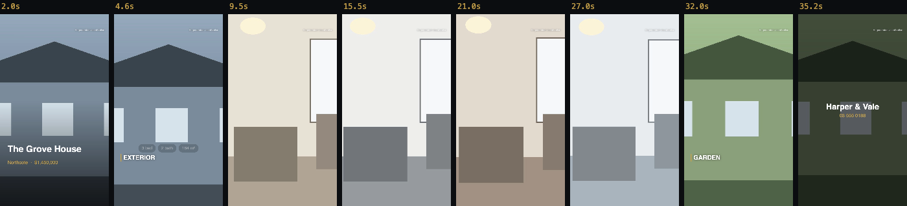
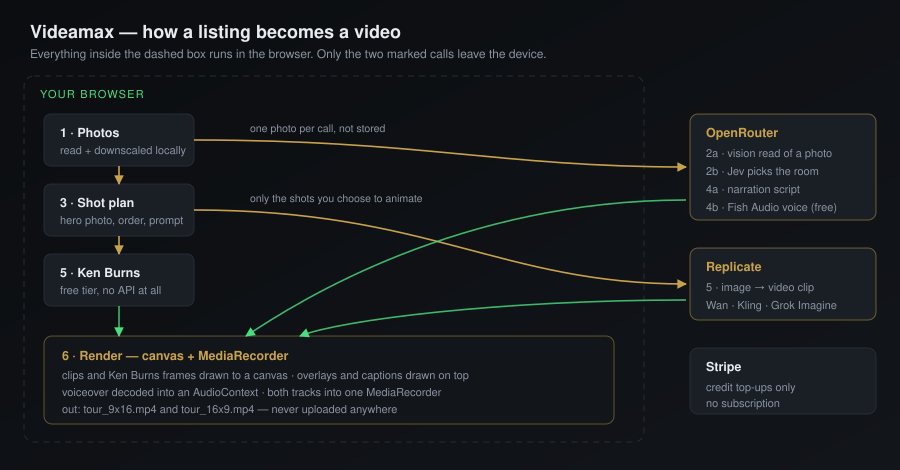
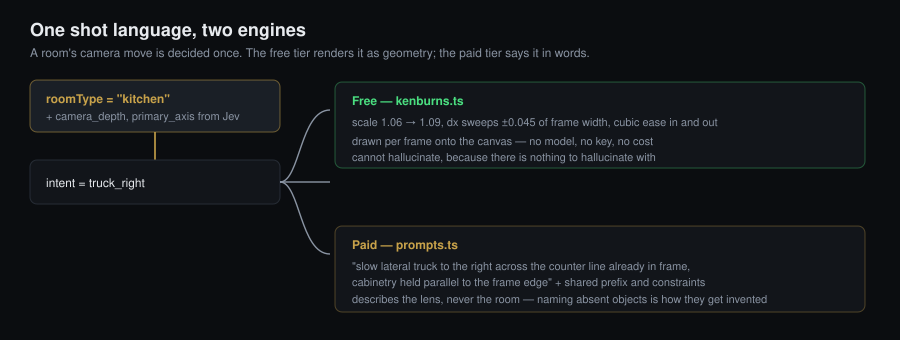

<div align="center">

# Videamax

### Turn listing photos into a narrated property tour video.

One cinematic shot per room, written and spoken narration, captions and motion graphics —
rendered in the browser, in both social and portal formats.

[](https://nextjs.org)
[](https://www.typescriptlang.org)
[](https://openrouter.ai)
[](https://replicate.com)
[](https://stripe.com)
[](LICENSE)

**[videamax.com](https://videamax.com)** · Need it inside your own agency? **[nexibeo.com](https://nexibeo.com)**

</div>

---

## What it does

Give it the photos you already have for a listing. It works out which room each photo is, gives
every room the camera move that suits that kind of room, writes a voiceover from your listing
details, speaks it, captions it, and renders a finished tour — all without a videographer, a
site visit or a drone.



*Eight frames from one 36-second render: intro card, room label with feature chips, five rooms
each with their own camera move, and the closing card. Rendered in a browser tab, from six
photographs.*

---

## How it works



| Stage | What happens | Where |
|---|---|---|
| **1 · Photos** | Read and downscaled to 1600px. | Your browser |
| **2 · Rooms** | A vision model *describes* each photo in words. **[Jev](https://openrouter.ai)** — a decision model — then picks the room type from a fixed list of 25 and returns a calibrated confidence. | OpenRouter |
| **3 · Plan** | Photos of the same physical room are grouped, the best photo of each becomes the hero shot, shots are ordered into the narrative an agent would cut, and each gets its prompt. | Your browser |
| **4 · Narration** | One script for the whole tour, written only from your listing fields, then spoken by Fish Audio. | OpenRouter |
| **5 · Clips** | Each hero photo becomes a moving clip — or a Ken Burns move if you're on the free tier. | Replicate / your browser |
| **6 · Render** | Clips, overlays, captions and voice composited on a canvas and captured to a file. | Your browser |

### Why Jev for the rooms

A vision model asked for JSON will happily return `"room_type": "bedroom"` with no honest measure
of how sure it is. Jev returns a probability for every option and a confidence for the answer, so
the app can do the thing that actually matters: **act automatically when it's sure, and flag the
photo when it isn't.** Anything under 0.75 gets a *check this* badge instead of a silent guess.

Jev is text-only, so the two passes are deliberately separate — the vision model describes, Jev
judges. That split is what makes the confidence mean anything.

### One shot language, two engines



A room's camera move is decided once and expressed two ways, so the free and paid tiers produce
the same *shot* — a kitchen trucks along the counter either way.

The prompt library has one rule it exists to enforce: **describe what the lens does, never what
the room contains.** Naming a sofa or a pool that isn't in the source photo is exactly how a model
is persuaded to invent one. Camera moves are also kept small, and get smaller at 10s and 15s,
because travel is what reveals that a still photograph has no real parallax.

---

## The three tiers

| | Free | Your own keys | Credits |
|---|---|---|---|
| **Cost** | nothing | provider cost | 10× provider cost |
| **8-shot video** | **$0.00** | **$0.98** | **$9.81** |
| **Keys needed** | none | OpenRouter + Replicate | none |
| **Room detection** | you label them | automatic | automatic |
| **Motion** | Ken Burns, in-browser | AI image-to-video | AI image-to-video |
| **Voiceover** | — | Fish Audio (free model) | Fish Audio |
| **Captions, graphics, 9:16 + 16:9** | ✅ | ✅ | ✅ |

The free tier is a real product rather than a teaser: a well-moved photograph beats a generated
clip that quietly bends a doorframe, and for a lot of listings it is the better output.

### Credits

Buy $10, $20 or $50. No subscription, nothing renews, nothing expires. One credit is one US cent
of charge, and every job shows its price before it spends anything. The `/pricing` page has a live
estimator driven by the same cost model the studio charges from.

**Worth knowing before you launch:** at a flat 10× markup an eight-shot video on the *cheapest*
AI engine lands at about **$9.81**, so a $10 pack buys exactly one. Video generation dominates
everything else in the bill — the room reading and the entire voiceover come to about two cents
together. If the packs should buy more than one video each, the lever is the markup
(`MARKUP` in `lib/pricing.ts`), not the pack sizes.

---

## Engines

Set per job — a draft to check the shot list costs cents; a hero listing can have the good model.

| Engine | Per second | Length | 8-shot video, 6s each | Good for |
|---|---|---|---|---|
| Ken Burns | free | 1–15s | **free** | drafts, and listings where motion beats generation |
| `wan-video/wan-2.2-i2v-fast` | $0.020 | 5–7s | $0.98 | cheapest real image-to-video |
| `wan-video/wan-2.5-i2v` | $0.050 | 5–10s | $2.42 | the standard choice |
| `kwaivgi/kling-v3-video` | $0.100 | 3–15s | $4.82 | best motion; reaches 15s comfortably |
| `xai/grok-imagine-video` | $0.050 | 1–15s | $2.42 | xAI's model, via a real API |

Length bounds, the image field name and negative-prompt support were read from each model's own
OpenAPI schema rather than from documentation — they vary more than you would expect. Wan 2.2 Fast
takes a frame count (81–121 at 16fps), which is why it cannot reach the 10s or 15s tiers at all;
the app clamps and charges for what the model will actually produce.

> The per-second **prices** are the one thing not machine-checked — Replicate does not expose them
> through the API. They are its published rates at the time of writing. Verify them against
> [replicate.com/pricing](https://replicate.com/pricing) before charging anyone, because these
> numbers set the credit price. `lib/replicate.ts` is the single place to correct them.

---

## Running it

```bash
git clone git@github.com:nexibeo/Real-Estate-Video-Generator.git
cd Real-Estate-Video-Generator
npm install
cp .env.example .env.local
npm run dev
```

Open <http://localhost:3100>. **The free tier works immediately with no keys and no `.env` at all** —
upload photos, label the rooms, render.

### Environment

Every variable is optional; each one unlocks a path.

| Variable | Unlocks |
|---|---|
| `OPENROUTER_API_KEY` | Automatic rooms, narration and voice for credit-paying users |
| `REPLICATE_API_TOKEN` | AI clips for credit-paying users |
| `STRIPE_SECRET_KEY`, `STRIPE_WEBHOOK_SECRET` | Selling credits |
| `ACCOUNT_COOKIE_SECRET` | Required in production — signs the anonymous account cookie |
| `CREDIT_STORE=upstash` + `UPSTASH_REDIS_REST_*` | A credit ledger that survives a restart |
| `NEXT_PUBLIC_GA_MEASUREMENT_ID` | Overrides the built-in GA4 property. Not needed: the production ID is committed and reports **only on videamax.com**, so forks and `npm run dev` send nothing |

Users who paste their own keys in `/settings` never touch the server's. Those keys live in that
browser's localStorage, ride along as request headers, and are never stored or logged by us.

### Deploying

Vercel, with the domain pointed at it and `NEXT_PUBLIC_SITE_URL=https://videamax.com`. Point a
Stripe webhook at `/api/stripe/webhook` for `checkout.session.completed`.

---

## Notable engineering

**Rendering is real-time, and the loop is policed.** `MediaRecorder` captures a canvas as it is
drawn, so a 36-second video takes 36 seconds. The trap is that `requestAnimationFrame` stops when
a tab is hidden *and* is throttled when the window is merely occluded, while the audio clock and
the recorder carry on — which silently records a frozen frame for as long as you look away.
`document.hidden` doesn't catch the occluded case, so the render watches for what it actually
needs to be true: that a frame was drawn in the last 250ms. When frames stop, the recorder and the
audio clock pause together; when they resume, so does everything else. The timeline is measured
from that same audio clock, so nothing drifts.

**Photos never get uploaded to us.** They are read, downscaled and rendered locally. Two things
leave, only when asked: one photo per classification call, and one photo per clip you choose to
animate. The finished video is assembled on your machine and never touches our disk.

**Clips are proxied, not hotlinked.** Drawing a cross-origin video onto a canvas taints it, and a
tainted canvas can't be captured — so generated clips come back through `/api/proxy`, which is
locked to Replicate's delivery hosts.

**The voiceover can't make things up.** The script model is given your listing fields and the
photo descriptions and instructed that those are the only facts it may use. It is separately
constrained against US fair-housing language. A false claim in an advertisement is the agent's
licence at risk, so this is the default with no switch to turn it off.

**Analytics cannot leak the thing the product promises to protect.** The event API in
`lib/analytics.ts` accepts only primitives describing the *shape* of a job — counts, tiers, engine
names, durations — and there is deliberately no generic `track(name, anyObject)` to reach for in a
hurry. Failures are reported as one of a fixed set of reason codes, never the error text, because
a message can carry a key fragment or a signed URL. Consent is denied by default under Consent
Mode v2, Global Privacy Control and Do Not Track are honoured as a standing no, and no event is
sent until a visitor opts in. And because this repository is public, the committed Measurement ID
only switches on when the page is served from videamax.com — a fork, a preview deploy or
`npm run dev` never loads the tag and never reports into the production property.

**Credits are only ever created by the Stripe webhook**, verified against the raw body, and made
idempotent on the Stripe event id — because the failure that matters is double-crediting a retry.

---

## Rights

**Videamax is for listings you own or represent.** Listing photos belong to whoever took them,
usually the photographer or the listing broker, and a promotional video made from someone else's
photos is a copyright problem however good it looks. Every job is gated on an explicit
attestation, recorded with a timestamp and a version hash of the exact wording agreed to.

Videos carry a small *AI-generated visualisation* tag by default. Some portals and MLS rules
require the disclosure, and the footage genuinely is synthesised from stills.

See [`/legal`](app/legal/page.tsx) in the app, and §3 of [PROJECT.md](PROJECT.md).

---

## Layout

```
app/
  page.tsx            landing        api/classify   vision read → Jev decision
  studio/             the app        api/script     narration script
  pricing/            estimator      api/tts        Fish Audio speech
  credits/            top-ups        api/video      Replicate start + poll
  settings/           BYOK keys      api/stripe/*   checkout + webhook
  legal/              rights         api/proxy      same-origin clip fetch
lib/
  taxonomy.ts         25 room types, described for a judge to match against
  prompts.ts          the prompt library + the shared motion intents
  jev.ts              the decisions call and its confidence thresholds
  planner.ts          grouping, hero selection, narrative order
  pricing.ts          the cost model — one source for every price shown
  analytics.ts        GA4 events, consent, and the no-PII event API
  render/             kenburns · template · overlays · engine
```

[PROJECT.md](PROJECT.md) is the original design document, including the full prompt library and
the reasoning behind each preset.

---

## For agencies

Videamax is the self-serve version. If you want this inside your own systems — your listing feed,
your branding, your templates, bulk rendering across a portfolio, your own models and
infrastructure, your compliance regime — that is a build, not a signup.

### → **[nexibeo.com](https://nexibeo.com)** — custom real estate video systems.

---

<div align="center">
<sub>MIT licensed. You must own or represent every listing you make a video of.</sub>
</div>
